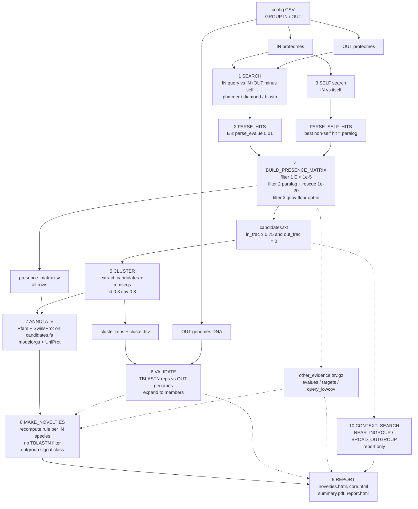
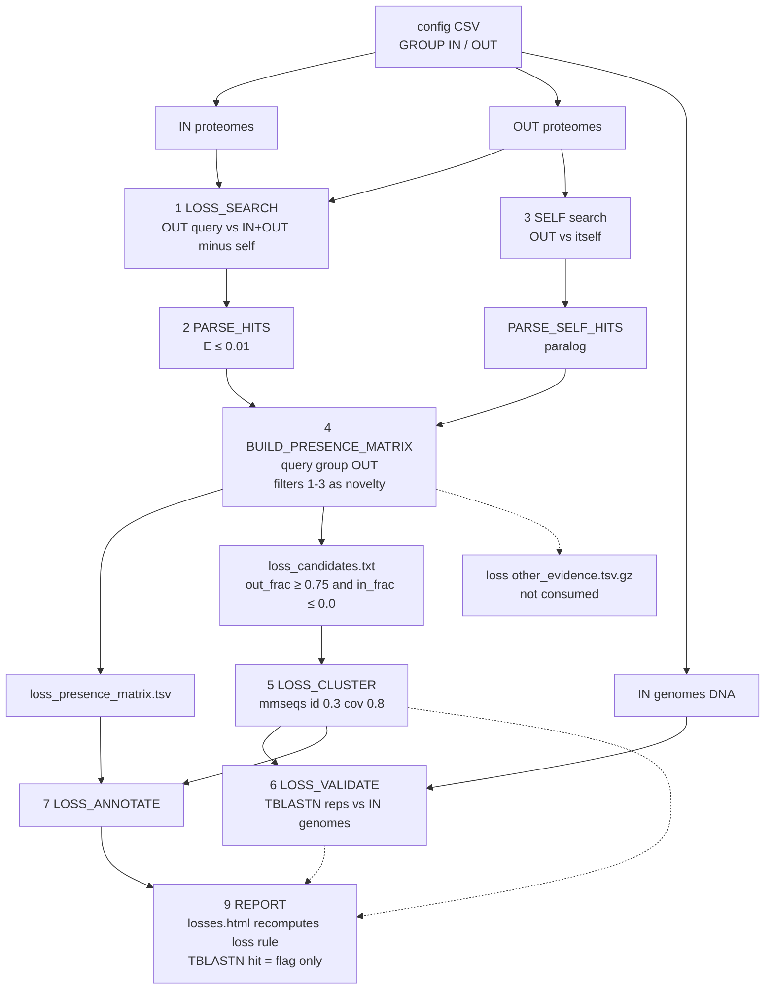

# Information flow: pairwise pipeline (`--cluster_tool pairwise`)

Source: `main.nf` lines 292-411 and the workflows and scripts named below. Step
numbers match `paper/methods_pairwise.md`. Dashed edges carry evidence that never
changes a candidate call.

## Novelty direction

## Loss direction

The loss direction differs. It swaps the query group, searches ingroup genomes with
TBLASTN, has no `MAKE_NOVELTIES` step and no context search, and does not consume its
other-evidence file.

## Step table

| # | Step | Nextflow process / script | Input files | Output files | Filtered or added at this step |
|---|---|---|---|---|---|
| 0 | Input parsing | `main.nf` `NOVINVENIO`; `lib/config_parser.py` | config CSV, `data_dir` FASTAs | channels per group | Stops if no `OUT` row (and no `IN` row) has DNA. Only `IN`/`OUT` enter the matrix. |
| 1 | Pairwise search | `PHMMER_SEARCH` / `DIAMOND_MAKEDB`+`DIAMOND_SEARCH` / `BLAST_MAKEDB`+`BLAST_SEARCH` (`workflows/search.nf`, `workflows/loss_search.nf`) | query-group proteomes; all `IN`+`OUT` proteomes | `search_cache/<Q>_vs_<T>.{phmmer.tblout,diamond.tsv,blast.tsv}.gz` | Self pairs excluded. DIAMOND/BLAST apply `--evalue 0.01`. |
| 2 | Hit parsing | `PARSE_HITS`; `bin/parse_hits.py`, `lib/hits.py` | raw hit files | `<Q>_vs_<T>.parsed.tsv` | Removes hits with E > `parse_evalue` (0.01). Adds metric columns (blank for phmmer). |
| 3 | Self search, paralog | `PHMMER_SELF` / `DIAMOND_SELF` / `BLAST_SELF`; `PARSE_SELF_HITS`, `bin/parse_self_hits.py` | query-group proteomes | `self_hits/<SHORT>.paralog_cutoffs.tsv` | Adds one paralog per protein (best non-self hit). Proteins without one are omitted. |
| 4 | Presence matrix, candidates | `BUILD_PRESENCE_MATRIX`; `bin/build_presence_matrix.py`, `lib/other_evidence.py` | all `*.parsed.tsv`, all `*.paralog_cutoffs.tsv`, config | `presence_matrix.tsv`, `candidates.txt`, `presence_matrix.evalues.tsv`, `presence_matrix.targets.tsv`, `presence_matrix.other_evidence.tsv.gz`, `presence_matrix.query_lowcov.tsv`, optional `presence_matrix.coverage_floor_rejections.tsv` (loss: `loss_` prefix) | Filter 1 (E < 1e-5), filter 2 (paralog competition, rescue E ≤ 1e-20), filter 3 (opt-in qcov floor, other group only). Self cell set to 1. Proteins with no surviving hit get no row. Candidate rule applied. Evidence sidecars added. |
| 5 | Extract, cluster | `EXTRACT_CANDIDATES` (`workflows/cluster.nf`), `bin/extract_candidates.py`; `MMSEQS_CLUSTER` (`modules/mmseqs_cluster.nf`), `bin/restore_mmseqs_cluster_ids.py` | `candidates.txt`, query-group proteomes, config | `candidates.fa`; `clusters/clusters_rep_seq.fasta`, `clusters_all_seqs.fasta`, `clusters_cluster.tsv` (loss: `loss_candidates.fa`, `loss_clusters_*`) | Nothing removed. Adds rep → member groups (id 0.3, cov 0.8). |
| 6 | TBLASTN validation | `TBLASTN_MAKEDB`, `TBLASTN` (`modules/tblastn.nf`); `SUMMARIZE_TBLASTN`, `BUILD_ALIGNMENT_SHARDS` (`workflows/validate.nf`); `bin/summarize_tblastn.py` | cluster reps, other-group genomes (novelty: `OUT`; loss: `IN`), cluster TSV, candidates list | `tblastn/<SHORT>.tblastn.tsv`, `tblastn_summary.tsv`, `tblastn_summary.coverage.tsv.gz`, `alignments/` (loss: `loss_` prefix, `loss_alignments/`) | Nothing removed. Adds per-genome hit (E ≤ 1e-5) for each rep, copied to all members, and rep span coverage. |
| 7 | Annotation | `ANNOTATE_MATRIX` (`workflows/annotate.nf`), `bin/annotate_presence_matrix.py`; `UNIPROT_LINK` | `candidates.fa`, presence matrix, optional Pfam / SwissProt / modelorgs / UniProt index | `presence_matrix.function.tsv`, `candidates.pfam.tblout`, `candidates.swissprot.tsv` (loss: `loss_` prefix) | Nothing removed. Adds gene name, product, Pfam, SwissProt, UniProt columns, and sequence for candidates. Pfam/SwissProt only for candidate proteins. |
| 8 | Per-species novelty tables (novelty only) | `MAKE_NOVELTIES` (`workflows/summarize.nf`), `bin/make_novelties.py` | `presence_matrix.function.tsv`, `tblastn_summary.tsv`, cluster TSV, config, `other_evidence.tsv.gz`, `tblastn_summary.coverage.tsv.gz` | `novelties.<SHORT>.tsv` | Recomputes the novelty rule per source species. TBLASTN filter skipped. Adds family columns, `tblastn_outgroup_hits`, `other_protein_*`, `other_tblastn_*`, `other_signal_class`. |
| 9 | Reports | `MAKE_REPORT(_ONLINE)`, `MAKE_CORE_REPORT`, `MAKE_LOSSES_REPORT(_ONLINE)`, `MAKE_PDF_REPORT`, `COLLATE_REPORTS` (`workflows/report.nf`); `lib/report_data.py` | annotated matrices, novelties tables, TBLASTN summaries, cluster TSVs, sidecars, config, `data_dir` (GFF3) | `novelties.html`, `core.html`, `losses.html`, `summary.pdf`, `report.html`, `alignment.html` | `novelties.html`: all matrix rows, novel flag from novelties tables. `core.html`: ingroup-sourced rows with presence ≥ 0.95 over all proteomes. `losses.html`: recomputes loss rule; TBLASTN hit is a flag. |
| 10 | Context search (novelty only) | `CONTEXT_SEARCH` (`workflows/context_search.nf`), `bin/context_presence.py` | `candidates.txt`, paralog files, `NEAR_INGROUP`/`BROAD_OUTGROUP` proteomes | `context_presence.tsv`, `context_presence.evalues.tsv` | Report-only presence of candidates in context proteomes (filters 1-3, filter 1 uses `--evalue`). No-op without such rows. |
