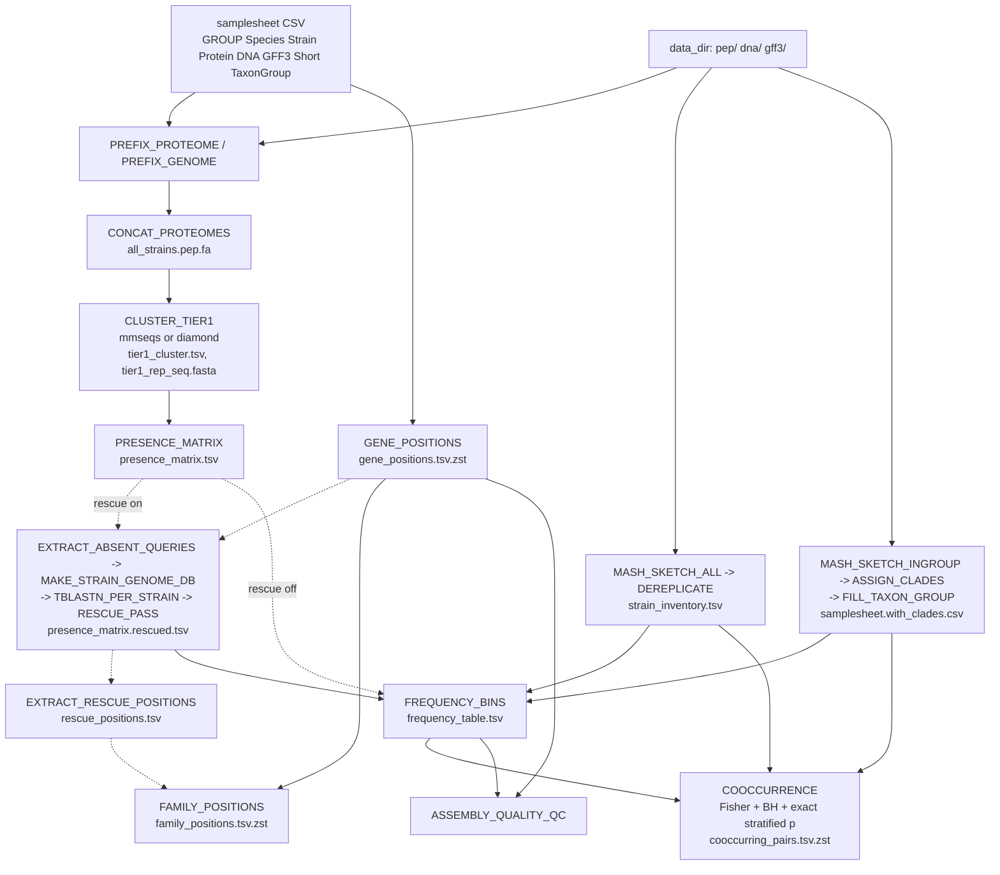
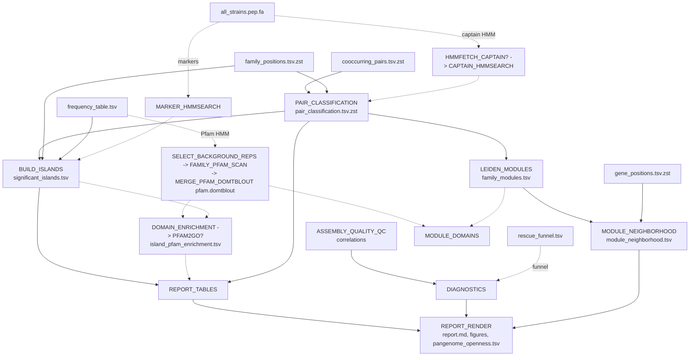
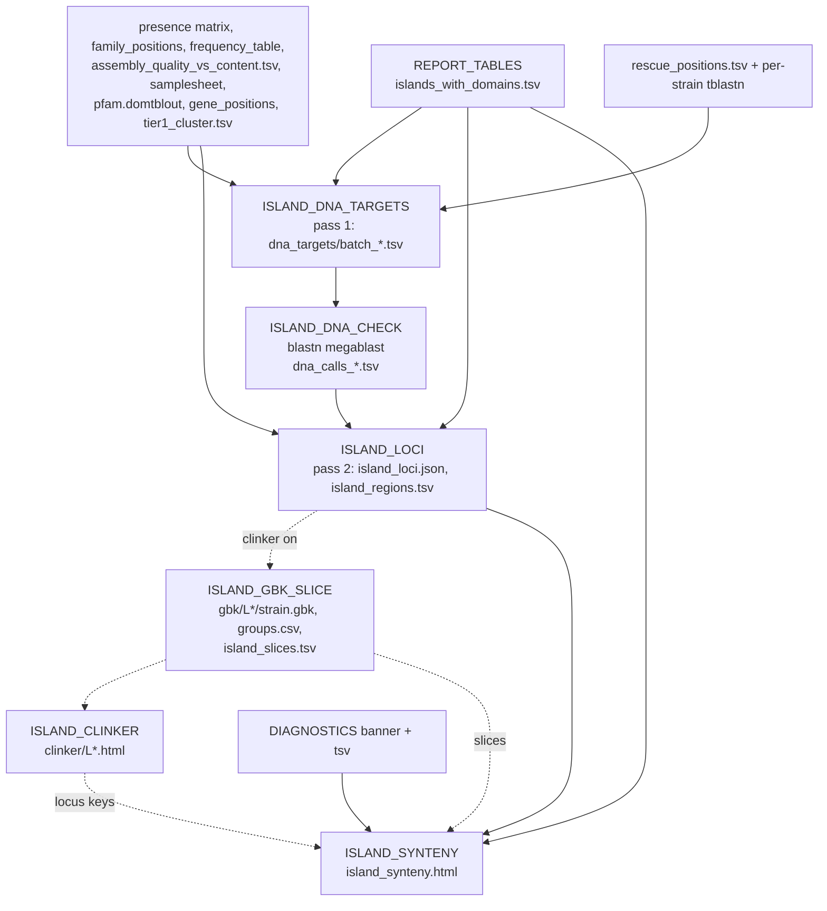

# Information flow: pangenome pipeline (`pangenome.nf`)

Source: `"pangenome.nf"`, `"workflows/pangenome_profile.nf"`, `"modules/pangenome/*.nf"`.
Statements are read from code unless tagged [UNVERIFIED]. Dashed edges are optional
branches. The flow is split into three charts. Chart 1b repeats the chart 1a output
files as its start nodes.

## Chart 1a: inputs to co-occurrence

## Chart 1b: co-occurrence to report

## Chart 2: island locus view, clinker pages, synteny page (Pfam branch only)

## Step table

| step | Nextflow process / script | input files | output files | filtered, added or tested |
|---|---|---|---|---|
| Samplesheet parse | `pangenome.nf` workflow block | samplesheet CSV, data_dir, gff3_dir | channels `[meta, protein, dna]`, ingroup DNA | Keeps rows with GROUP = IN or OUT. Fails on missing GFF3 or bad params. |
| Prefix | `PREFIX_PROTEOME`, `PREFIX_GENOME` / `pangenome_prefix_fasta.py` | protein FASTA, genome FASTA | `<Short>.prefixed.pep.fa`, `<Short>.prefixed.dna.fa` | Adds `Short|` to each header. |
| Concatenate | `CONCAT_PROTEOMES` (`cat`) | prefixed proteomes | `all_strains.pep.fa` | Nothing filtered. No isoform collapse. |
| Tier-1 clustering | `CLUSTER_TIER1` / `pangenome_cluster_backend.py` (+ `verify_diamond_cluster_ids.py`) | `all_strains.pep.fa` | `tier1_cluster.tsv`, `tier1_rep_seq.fasta` | Families at 90% id / 80% cov (`--cov-mode 0`, `--cluster-reassign` for mmseqs). |
| Presence matrix | `PRESENCE_MATRIX` / `pangenome_build_presence_matrix.py` | cluster TSV, samplesheet | `presence_matrix.tsv`, `.copy_number.tsv` | Adds present/absent calls for IN+OUT strains. Singletons kept. |
| Gene positions | `GENE_POSITIONS` / `pangenome_build_gene_positions.py` | samplesheet, GFF3s, `data_dir/pep` FASTAs | `gene_positions.tsv.zst` | Keeps CDS IDs that match the FASTA. Fails if < 50% match. |
| Absent queries | `EXTRACT_ABSENT_QUERIES` / `pangenome_extract_absent_family_queries.py` | presence matrix, rep FASTA | `per_strain_queries/<Short>.absent.fa`, `manifest.tsv` | Selects reps of families absent per strain. |
| Genome DB | `MAKE_STRAIN_GENOME_DB` (`makeblastdb`) | prefixed genome | `<Short>.genome_db.*` | none |
| TBLASTN | `TBLASTN_PER_STRAIN` (`tblastn`) | DB, absent queries | `<Short>.tblastn.tsv.zst` | e-value 1e-10, max 200 targets. |
| Rescue | `RESCUE_PASS` / `pangenome_rescue_pass.py` | matrix, tblastn files, gene positions, cluster TSV, rep FASTA | `presence_matrix.rescued.tsv`, `rescue_funnel.tsv` | Filters pident >= 90, qcovs >= 80, overlap with other-family gene, rep < 150 aa, hotspot (>= 3 families per 2 kb bin). Changes absent -> genome_only. |
| Rescue positions | `EXTRACT_RESCUE_POSITIONS` / `pangenome_extract_rescue_positions.py` | rescued matrix, tblastn files | `rescue_positions.tsv` | Best-bitscore HSP per genome_only cell (identity/coverage only; no structural filter). |
| Mash (all) | `MASH_SKETCH_ALL` (`mash sketch`, `mash dist -t`) | IN+OUT genomes | `all_strains.mash_dist.tsv` | Mash default sketch [UNVERIFIED values]. |
| Dereplicate | `DEREPLICATE` / `pangenome_dereplicate_strains.py` | samplesheet, `data_dir/dna`, mash dist | `strain_inventory.tsv` | Single-linkage groups at distance < 0.001. Rep = highest N50. |
| Mash (ingroup) | `MASH_SKETCH_INGROUP` | IN genomes | `ingroup.mash_dist.tsv` | none |
| Clades | `ASSIGN_CLADES` / `pangenome_assign_clades.py` | samplesheet, mash dist | `clade_assignments.tsv` | PCoA (4 axes) + k-means, k by silhouette over 2..10. |
| TaxonGroup fill | `FILL_TAXON_GROUP` / `pangenome_fill_taxon_group.py` | samplesheet, clades | `samplesheet.with_clades.csv` | Fills empty TaxonGroup only. |
| Frequency bins | `FREQUENCY_BINS` / `pangenome_frequency_bins.py` | rescued matrix, effective samplesheet, inventory | `frequency_table.tsv` | Adds `bin` (ingroup reps) and `bin_out` (outgroup reps, if >= 3). |
| Co-occurrence | `COOCCURRENCE` / `pangenome_cooccurrence.py` (+ `lib/ancestral_states.py`) | rescued matrix, frequency table, effective samplesheet, inventory, optional tree | `cooccurring_pairs.tsv.zst` | Tests shell+cloud families with >= 5 carriers (ingroup reps): screen, one-sided Fisher, BH q < 0.05, then exact stratified p (uncorrected). Adds polarity columns. |
| Assembly QC | `ASSEMBLY_QUALITY_QC` / `pangenome_assembly_quality_qc.py` | effective samplesheet, `data_dir/dna`, rescued matrix, frequency table, gene positions, cluster TSV | `assembly_quality_vs_content.tsv`, `_correlations.tsv`, `_report.md` | Spearman rho (raw, partial) of content vs N50/contigs. No p-values. No filtering. |
| Family positions | `FAMILY_POSITIONS` / `pangenome_build_family_positions.py` | gene positions, cluster TSV, rescue positions | `family_positions.tsv.zst` | Adds per-strain gene-order ranks per family copy. |
| Captain search | `HMMFETCH_CAPTAIN`, `CAPTAIN_HMMSEARCH` (`hmmfetch`, `hmmsearch -E 1e-3`) | Pfam/captain HMM, all proteins | `captain_vs_study.tblout` | Optional. |
| Pair classification | `PAIR_CLASSIFICATION` / `pangenome_pair_classification.py` | pairs, family positions, cluster TSV, captain tblout | `pair_classification.tsv.zst` | Labels each pair: insufficient_data, starship_explained, unexplained_physical, ambiguous_linkage, trans, trans_unconfirmed (k = 10; 0.5 / 0.05; perm p < 0.05; >= 2 clades). |
| Leiden modules | `LEIDEN_MODULES` / `pangenome_detect_trans_modules.py` | pair classification | `family_modules.tsv`, `module_summary.tsv` | Graph of `trans` pairs, weight -log10(q), resolution 1.0. |
| Module neighbourhood | `MODULE_NEIGHBORHOOD` / `pangenome_neighborhood.py` | family modules, gene positions, cluster TSV, frequency table | `module_neighborhood.tsv` | Within-strain permutation test (200 draws, accessory pool), 100 kb, gap >= 11. |
| Marker search | `MARKER_HMMSEARCH` (`hmmsearch -E 1e-5`) | marker HMMs, all proteins | `<name>_vs_study.tblout` | Optional. |
| Islands | `BUILD_ISLANDS` / `pangenome_build_islands.py` | family positions, frequency table, pair classification, cluster TSV, marker tblouts | `significant_islands.tsv` | Keeps runs of non-core genes (>= 2) holding a physical/ambiguous pair. Dedup by (family set, classification set). |
| Background reps | `SELECT_BACKGROUND_REPS` / `pangenome_select_background_reps.py` | rep FASTA, frequency table | `background_reps.fa` | Keeps shell+cloud reps. Pfam branch only. |
| Pfam scan | `HMMPRESS_PFAM`, `FAMILY_PFAM_SCAN` (`hmmscan --domE 1e-3`), `MERGE_PFAM_DOMTBLOUT` | background reps (3000 per chunk), Pfam-A.hmm | `pfam.domtblout` | Pfam branch only. |
| Domain enrichment | `DOMAIN_ENRICHMENT` / `pangenome_domain_enrichment.py` | islands, domtblout, frequency table | `island_pfam_enrichment.tsv` | Pooled one-sided Fisher per domain, BH. i-Evalue <= 1e-3. |
| GO mapping | `PFAM2GO` / `pangenome_pfam2go.py` | enrichment, pfam2go file | annotated enrichment TSV | Optional. Adds GO IDs. |
| Module domains | `MODULE_DOMAINS` / `pangenome_module_domains.py` | family modules, domtblout | `module_domains.tsv` | Pfam branch only. Counts only. |
| Report tables | `REPORT_TABLES` / `pangenome_report_tables.py` | islands, enrichment, pairs, matrix, frequency table, domtblout, cluster TSV, gene positions, samplesheet, inventory | `islands_with_domains.tsv`, `island_size_distribution.tsv`, `classification_counts.tsv`, `marker_summary.tsv`, `per_strain_summary.tsv`, `group_class_overlap.tsv` | Adds island locus spans, per-strain counts, modified-z outliers (|z| > 3.5). |
| Diagnostics | `DIAGNOSTICS` / `pangenome_diagnostics.py` | rescue funnel, QC correlations | `diagnostics.tsv`, banners | Trips at overlap share > 0.5 and |rho| > 0.3. |
| Report render | `REPORT_RENDER` / `pangenome_report_render.py` | frequency table, matrix, report tables, enrichment, diagnostics banner, module neighbourhood, samplesheet | `report/report.md`, figures, `pangenome_openness.tsv` | Accumulation curve (20 orders, all strains), Heaps fit, core decay fit. |
| DNA targets | `ISLAND_DNA_TARGETS` / `pangenome_island_loci.py` (pass 1) | see chart 2 | `dna_targets/batch_*.tsv` | Loci grouped (containment 0.5), up to 200 candidates; selects checked strains. |
| DNA check | `ISLAND_DNA_CHECK` / `pangenome_island_dna_check.py` | batch file, samplesheet, `data_dir/dna` | `dna_calls_*.tsv` | Tests DNA presence: HSP id >= 90, gene coverage >= 80%. |
| Locus view | `ISLAND_LOCI` / `pangenome_island_loci.py` (pass 2) | see chart 2 | `island_loci.json`, `island_regions.tsv` | Exemplar, cell states, row classes, 5 rank scores, drawn set (<= 100), clinker strain picks (<= 12). |
| GenBank slices | `ISLAND_GBK_SLICE` / `pangenome_island_gbk_slice.py` | regions, samplesheet, data_dir, GFF3s, gene positions, rescue positions, cluster TSV | `gbk/L*/<strain>.gbk`, `groups.csv`, `island_slices.tsv` | Splits regions at gene-free gaps > 20 kb. Checks anchors. |
| Clinker | `ISLAND_CLINKER` / `pangenome_island_clinker.py` (`clinker -gf -ufo`) | locus dirs (50 per task) | `clinker/L*.html` | Strips sequences (slim). Skips failed loci. |
| Island synteny page | `ISLAND_SYNTENY` / `pangenome_island_synteny.py` | islands with domains, matrix, positions, domtblout, samplesheet, diagnostics, loci JSON, slices, clinker keys | `island_synteny.html` | Islands with locus and >= 2 strains, top 50 by size; haplotype rows. |
